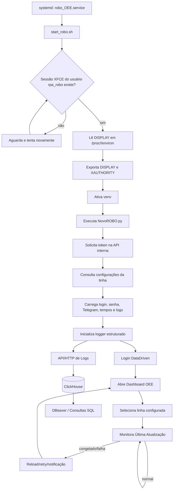

# Monitor OEE Dashboard — RPA de Exibição, Supervisão e Observabilidade

Automação profissional para manter o **Dashboard OEE** da plataforma DataDriven aberto, atualizado e visível em tela cheia em uma estação/VM Linux com ambiente gráfico.

O processo foi desenhado para operar de forma contínua, com recuperação automática em caso de travamento do dashboard, notificações por Telegram, painel auxiliar para acompanhamento dos recursos da máquina e uma camada de observabilidade com envio de logs estruturados para **ClickHouse**, analisados via **DBeaver**.

Um dos diferenciais do projeto é que as configurações operacionais não ficam presas em arquivos locais. O robô busca dinamicamente os parâmetros necessários em uma **API interna de configuração**, permitindo parametrização centralizada por linha de produção.

> **Ponto crítico da infraestrutura:** este robô depende de uma sessão gráfica real. Em uma VM compartilhada por vários usuários, o `DISPLAY` não pode ser fixo (`:0`, `:1`, etc.), porque ele pode variar conforme a sessão ativa. Por isso, o boot do robô localiza dinamicamente a sessão `xfce4` do usuário de operação e injeta o `DISPLAY` correto antes de iniciar o Playwright.

---

## Visão geral

O projeto é composto por dois processos principais:

| Processo      | Arquivo            | Objetivo                                                                                                                                              |
| ------------- | ------------------ | ----------------------------------------------------------------------------------------------------------------------------------------------------- |
| Robô OEE      | `NovoROBO.py`      | Consulta configurações via API, acessa a plataforma DataDriven, autentica, abre o Dashboard OEE, seleciona a linha configurada e mantém a tela ativa. |
| Monitor local | `Monitoramento.py` | Expõe um painel Flask para acompanhar CPU, RAM, disco, rede, histórico e picos de utilização da VM.                                                   |

Além disso, há uma camada de infraestrutura para inicialização automática:

| Arquivo            | Função                                                                                                                 |
| ------------------ | ---------------------------------------------------------------------------------------------------------------------- |
| `start_robo.sh`    | Script de boot que detecta dinamicamente o `DISPLAY`, exporta `XAUTHORITY`, ativa o ambiente virtual e executa o robô. |
| `robo_OEE.service` | Unidade `systemd` que mantém o robô em execução e reinicia automaticamente em caso de falha.                           |

O robô também possui uma camada de configuração e observabilidade:

| Componente                  | Função                                                                                                                    |
| --------------------------- | ------------------------------------------------------------------------------------------------------------------------- |
| API interna de configuração | Fornece parâmetros de execução por linha de produção.                                                                     |
| API/endpoint de logs        | Recebe eventos estruturados gerados durante a execução do robô.                                                           |
| ClickHouse                  | Armazena logs operacionais em formato analítico, permitindo consultas rápidas por rotina, severidade, linha, IP e sessão. |
| DBeaver                     | Ferramenta usada para consultar, validar e analisar os logs gravados no ClickHouse.                                       |

---

## Principais recursos

* Carregamento dinâmico de configurações via API interna.
* Parametrização por linha de produção sem necessidade de alterar o código-fonte.
* Login automático na plataforma DataDriven usando credenciais carregadas pela API.
* Navegação automatizada até o menu **Dashboard > Manufatura > OEE-Online**.
* Interação com conteúdo dentro de `iframe` usando Playwright.
* Seleção automática da linha configurada pela API.
* Ajuste de visualização para modo tela cheia/kiosk com Playwright, `F11` e `xdotool`.
* Verificação contínua do indicador **Última Atualização** para detectar dashboard congelado.
* Reload periódico configurável por `F5` ou recarregamento da página.
* Recuperação automática com retry quando a abertura do dashboard falha.
* Notificações por Telegram em eventos importantes ou falhas.
* Serviço `systemd` com restart automático.
* Monitor Flask opcional para saúde da VM: CPU, RAM, disco, rede e picos.
* Suporte a acesso externo do monitor via ngrok, quando configurado.
* Envio de logs estruturados para ClickHouse por API/HTTP.
* Registro de eventos com severidade, rotina, mensagem, IP da máquina, linha de produção, UID e sessão.
* Consulta dos logs pelo DBeaver para troubleshooting, auditoria e análise operacional.

---

## Arquitetura do processo



---

## Infraestrutura: captura dinâmica do DISPLAY

### Por que isso foi necessário?

O robô usa navegador Chromium em modo **não headless** (`headless=False`) e também ferramentas de interação com tela, como `xdotool`. Portanto, ele precisa estar conectado a uma sessão gráfica X11 válida.

Em uma VM com **múltiplos usuários** ou múltiplas sessões gráficas, o valor de `DISPLAY` pode mudar entre execuções. Fixar manualmente algo como `DISPLAY=:0` cria risco de o serviço iniciar no display errado, não encontrar a tela do usuário correto ou falhar ao abrir o navegador.

### Como foi resolvido?

O script `start_robo.sh` procura o processo `xfce4-session` do usuário operacional `rpa_robo`, lê as variáveis de ambiente reais desse processo em `/proc/<pid>/environ`, extrai o `DISPLAY` ativo e exporta esse valor para o processo do robô.

Fluxo implementado:

1. O serviço `systemd` inicia `start_robo.sh` como usuário `rpa_robo`.
2. O script aguarda até 30 tentativas, com intervalo de 10 segundos, pela sessão `xfce4-session`.
3. Ao encontrar a sessão, lê o `DISPLAY` diretamente do ambiente do processo XFCE.
4. Exporta `DISPLAY` e `XAUTHORITY=/home/rpa_robo/.Xauthority`.
5. Entra no diretório do projeto, ativa o `venv` e executa `NovoROBO.py`.
6. Caso nenhum display seja encontrado em até 5 minutos, aborta com erro para o `systemd` reiniciar conforme a política configurada.

Essa abordagem deixa o robô mais robusto para operação em VM compartilhada, pois ele sempre tenta acoplar o Chromium ao display gráfico realmente associado ao usuário de operação.

---

## Estrutura do repositório

```text
.
├── Monitoramento.py     # Painel Flask de monitoramento da VM
├── NovoROBO.py          # Automação principal do Dashboard OEE
├── README.md            # Documentação do projeto
├── robo_OEE.service     # Unidade systemd do robô
└── start_robo.sh        # Boot script com descoberta dinâmica de DISPLAY
```

---

## Pré-requisitos

### Sistema operacional

* Linux com ambiente gráfico X11.
* Sessão XFCE para o usuário operacional `rpa_robo`.
* Python 3.9 ou superior.
* `systemd` para execução como serviço.

### Pacotes do sistema

Instale os utilitários necessários para execução com navegador e controle de tela:

```bash
sudo apt update
sudo apt install -y python3 python3-venv python3-pip xdotool
```

> Dependendo da distribuição, o Playwright pode solicitar bibliotecas adicionais do Chromium. Nesse caso, execute `playwright install-deps` dentro do ambiente virtual.

### Dependências Python

O projeto utiliza, no mínimo:

* `playwright`
* `requests`
* `flask`
* `psutil`
* `pyngrok` opcional, apenas para acesso externo ao monitor
* `sdnotify` quando utilizado watchdog integrado ao systemd

---

## Instalação

### 1. Clonar ou copiar o projeto

O serviço atual espera o projeto no diretório abaixo:

```bash
/home/rpa_robo/Robo_OEE
```

Exemplo:

```bash
sudo -u rpa_robo git clone <URL_DO_REPOSITORIO> /home/rpa_robo/Robo_OEE
cd /home/rpa_robo/Robo_OEE
```

### 2. Criar ambiente virtual

```bash
python3 -m venv venv
source venv/bin/activate
python -m pip install --upgrade pip
```

### 3. Instalar dependências

Se houver um `requirements.txt` no ambiente de implantação:

```bash
pip install -r requirements.txt
```

Ou instale manualmente as dependências mínimas:

```bash
pip install playwright requests flask psutil pyngrok sdnotify
playwright install chromium
```

### 4. Configurar permissões do script de boot

```bash
chmod +x /home/rpa_robo/start_robo.sh
```

> Se o script ficar dentro do repositório, copie ou referencie corretamente em `/home/rpa_robo/start_robo.sh`, conforme configurado em `robo_OEE.service`.

---

## Configuração dinâmica via API

Diferente de uma configuração local baseada em `.env`, este projeto carrega os parâmetros de execução diretamente de uma API interna de configuração.

Ao iniciar, o robô consulta o sistema, busca os dados cadastrados para cada linha de produção e monta dinamicamente as variáveis necessárias para execução. Isso permite controlar credenciais, tempos de espera, modo de atualização, parâmetros do Telegram e dados da API de logs sem alterar o código-fonte ou acessar manualmente a VM.

Essa abordagem melhora a manutenção e reduz hardcode, pois cada linha pode ter sua própria configuração centralizada.

### Parâmetros carregados pela API

| Parâmetro                             | Descrição                                                 |
| ------------------------------------- | --------------------------------------------------------- |
| `Login`                               | Usuário de acesso à plataforma DataDriven.                |
| `senha`                               | Senha de acesso à plataforma.                             |
| `linha`                               | Linha ou unidade produtiva que será monitorada.           |
| `Telegram_Token`                      | Token usado para envio de alertas via Telegram.           |
| `Telegram_Chat_ID`                    | Chat ID de destino dos alertas.                           |
| `TEMPO_ATUALIZACAO_SEGUNDOS`          | Intervalo entre ciclos de atualização do dashboard.       |
| `MODO_ATUALIZACAO`                    | Estratégia de atualização, como `F5` ou reload da página. |
| `ESPERA_CARREGAMENTO_LINHAS_SEGUNDOS` | Tempo de espera para carregamento da lista de linhas.     |
| `ESPERA_ENTRE_ACOES_IFRAME_SEGUNDOS`  | Pausa entre ações realizadas dentro do iframe.            |
| `LOG_URL`                             | Endpoint usado para envio dos logs estruturados.          |
| `LOG_USER`                            | Usuário de autenticação da API de logs/ClickHouse.        |
| `LOG_PASSWORD`                        | Senha de autenticação da API de logs/ClickHouse.          |

### Fluxo de carregamento

1. O robô inicia recebendo ou assumindo uma linha alvo.
2. Solicita um token de autenticação na API.
3. Consulta o endpoint de configurações do sistema.
4. Extrai os registros de configuração disponíveis.
5. Localiza a configuração da linha alvo.
6. Converte os parâmetros recebidos em variáveis de execução.
7. Inicializa Playwright, Telegram, logger e ciclo de monitoramento com base nesses dados.

### Benefícios

* Evita configuração manual em cada VM.
* Reduz hardcode no código-fonte.
* Permite alterar parâmetros sem redeploy.
* Facilita operação com múltiplas linhas de produção.
* Centraliza credenciais e parâmetros operacionais.
* Melhora rastreabilidade e manutenção.
* Aproxima o projeto de uma arquitetura orientada a configuração.

---

## Execução manual

Com uma sessão gráfica ativa para o usuário correto:

```bash
cd /home/rpa_robo/Robo_OEE
source venv/bin/activate
python NovoROBO.py NOME_DA_LINHA
```

Caso nenhuma linha seja informada por argumento, o robô pode assumir uma linha padrão definida no código.

Para executar o monitor local:

```bash
cd /home/rpa_robo/Robo_OEE
source venv/bin/activate
python Monitoramento.py
```

Acesse:

* Local: `http://localhost:5001`
* Rede: `http://<IP_DA_VM>:5001`
* Externo: URL pública do ngrok, quando o acesso externo estiver configurado.

---

## Execução como serviço systemd

### 1. Instalar a unidade

```bash
sudo cp robo_OEE.service /etc/systemd/system/robo_OEE.service
sudo systemctl daemon-reload
```

### 2. Habilitar inicialização automática

```bash
sudo systemctl enable robo_OEE.service
```

### 3. Iniciar o serviço

```bash
sudo systemctl start robo_OEE.service
```

### 4. Verificar status e logs

```bash
sudo systemctl status robo_OEE.service
journalctl -u robo_OEE.service -f
```

O serviço está configurado para:

* rodar como usuário `rpa_robo`;
* iniciar após rede e ambiente gráfico;
* executar `/home/rpa_robo/start_robo.sh`;
* reiniciar automaticamente em caso de falha;
* aguardar 15 segundos entre reinícios.

---

## Comportamento operacional do robô

1. Recebe ou assume a linha de produção alvo.
2. Busca as configurações da linha via API interna.
3. Inicializa credenciais, parâmetros de tempo, Telegram e logger remoto.
4. Inicia o Chromium em modo visível, maximizado, fullscreen/kiosk.
5. Abre a tela de login da plataforma DataDriven.
6. Preenche e envia as credenciais carregadas pela API.
7. Navega pelo menu até o Dashboard OEE.
8. Injeta a chamada `loadPageNew(...)` para carregar o dashboard desejado no `iframe`.
9. Aguarda a lista de linhas e clica no botão **Detalhes** da linha configurada.
10. Executa interações iniciais no iframe: refresh, modo tela cheia, fechamento de modal e F11.
11. Monitora o campo **Última Atualização** em ciclos periódicos.
12. Caso o dashboard congele, executa recuperação com reload, retry e notificação.
13. Também realiza atualização periódica conforme `TEMPO_ATUALIZACAO_SEGUNDOS`.
14. Durante o fluxo, registra eventos estruturados em uma API de logs integrada ao ClickHouse.
15. Os logs podem ser consultados no DBeaver para análise de falhas, reinícios, tentativas e comportamento por linha.

---

## Observabilidade com API de Logs, ClickHouse e DBeaver

Além dos logs locais do `systemd`, o robô envia eventos estruturados para uma base ClickHouse. Essa camada permite acompanhar a execução de forma centralizada, mesmo quando existem múltiplas VMs, múltiplas linhas de produção ou múltiplas instâncias do robô.

A ideia é transformar cada evento importante do processo em dado consultável:

* início do processo;
* carregamento das configurações;
* login realizado;
* abertura do dashboard;
* seleção da linha;
* tentativa de clique/preenchimento;
* reload periódico;
* health check;
* dashboard congelado;
* tela de carregamento travada;
* falha recuperável;
* erro fatal;
* reinicialização do ciclo.

### Estrutura dos eventos

Cada log pode carregar campos como:

| Campo              | Descrição                                                    |
| ------------------ | ------------------------------------------------------------ |
| `id`               | Identificador único do evento.                               |
| `id_session`       | Identificador da sessão de execução.                         |
| `sistema`          | Nome do sistema ou robô que gerou o log.                     |
| `rotina`           | Função ou etapa em execução.                                 |
| `usuario`          | Usuário lógico relacionado ao processo.                      |
| `tipo`             | Severidade do evento: `INFO`, `DEBUG`, `WARNING` ou `ERROR`. |
| `mensagem`         | Descrição do evento.                                         |
| `ip_user`          | IP da máquina onde o robô está rodando.                      |
| `unidade_producao` | Linha ou unidade produtiva monitorada.                       |
| `uid`              | Identificador único da execução.                             |

Exemplo:

```json
{
  "id": 1770000000000000,
  "id_session": "session-id",
  "sistema": "OEE-Dashboard-Bot",
  "rotina": "monitorar_dashboard",
  "usuario": "system",
  "tipo": "INFO",
  "mensagem": "Dashboard aberto. Loop de atualização iniciado.",
  "ip_user": "192.168.0.10",
  "unidade_producao": "Linha 01",
  "uid": "uuid-da-execucao"
}
```

### Exemplo de gravação no ClickHouse

Os eventos podem ser enviados em formato `JSONEachRow`, formato eficiente para ingestão de registros estruturados no ClickHouse:

```sql
INSERT INTO datawake_logs.logs FORMAT JSONEachRow
```

Com isso, cada evento do robô vira uma linha consultável, permitindo analisar o histórico operacional sem depender apenas de arquivos locais ou do `journalctl`.

### Consultas úteis no DBeaver

Quantidade de eventos por severidade:

```sql
SELECT
    tipo,
    count(*) AS total
FROM datawake_logs.logs
WHERE sistema = 'OEE-Dashboard-Bot'
GROUP BY tipo
ORDER BY total DESC;
```

Erros recentes:

```sql
SELECT
    unidade_producao,
    rotina,
    mensagem,
    ip_user,
    uid
FROM datawake_logs.logs
WHERE sistema = 'OEE-Dashboard-Bot'
  AND tipo = 'ERROR'
ORDER BY id DESC
LIMIT 50;
```

Eventos por linha de produção:

```sql
SELECT
    unidade_producao,
    tipo,
    count(*) AS total
FROM datawake_logs.logs
WHERE sistema = 'OEE-Dashboard-Bot'
GROUP BY unidade_producao, tipo
ORDER BY unidade_producao, total DESC;
```

Análise de rotinas com mais falhas:

```sql
SELECT
    rotina,
    count(*) AS total_erros
FROM datawake_logs.logs
WHERE sistema = 'OEE-Dashboard-Bot'
  AND tipo = 'ERROR'
GROUP BY rotina
ORDER BY total_erros DESC;
```

### Benefício operacional

Com ClickHouse e DBeaver, o robô deixa de ser apenas uma automação visual e passa a ter uma camada de análise operacional. Isso permite responder perguntas como:

* Quais linhas falham mais?
* Quais rotinas geram mais erros?
* Quantas vezes o dashboard precisou ser reiniciado?
* Existem horários com maior instabilidade?
* A falha está concentrada em uma VM, linha ou etapa específica?
* As falhas estão relacionadas a configuração, login, iframe, reload ou instabilidade do portal?

Essa camada é especialmente útil para troubleshooting, auditoria técnica e criação futura de dashboards em Grafana ou outra ferramenta de BI/observabilidade.

---

## Monitoramento da VM

O arquivo `Monitoramento.py` sobe uma aplicação Flask com:

* endpoint `/api/stats` para métricas atuais e histórico;
* endpoint `/api/limpar_picos` para limpar picos registrados;
* dashboard web embutido em HTML/CSS/JavaScript;
* coleta periódica configurável por `MONITOR_INTERVALO`;
* histórico em memória limitado por `MONITOR_HISTORICO`;
* persistência dos últimos picos em `monitor_picos.json`;
* túnel ngrok opcional para acesso externo.

Esse monitor é útil para validar se a VM tem recursos suficientes para manter navegador, sessão gráfica e automação rodando continuamente.

---

## Troubleshooting

### O robô não abre o navegador

Verifique se existe sessão gráfica XFCE ativa para o usuário `rpa_robo`:

```bash
pgrep -u rpa_robo xfce4-session -a
```

Se não houver sessão, faça login gráfico com o usuário operacional ou reinicie o ambiente gráfico da VM.

### Erro relacionado a DISPLAY

Confirme se o script consegue detectar o `DISPLAY`:

```bash
bash /home/rpa_robo/start_robo.sh
```

Nos logs deve aparecer algo como:

```text
DISPLAY encontrado: :1
Iniciando robô com DISPLAY=:1
```

Se o valor não aparecer, a sessão XFCE ainda não está disponível ou pertence a outro usuário.

### Playwright não encontra navegador ou bibliotecas

Execute dentro do `venv`:

```bash
playwright install chromium
playwright install-deps
```

### Serviço reiniciando repetidamente

Acompanhe os logs:

```bash
journalctl -u robo_OEE.service -f
```

Valide especialmente:

* existência do diretório `/home/rpa_robo/Robo_OEE`;
* existência do `venv`;
* permissão de execução do `start_robo.sh`;
* sessão XFCE ativa;
* conectividade com a plataforma DataDriven;
* conectividade com a API interna de configuração;
* conectividade com a API de logs/ClickHouse, caso os logs remotos estejam habilitados;
* existência da configuração da linha alvo na API.

### Configuração da linha não encontrada

Verifique:

* se a linha informada existe na API interna;
* se o nome da linha está exatamente igual ao cadastro;
* se os campos obrigatórios foram preenchidos;
* se o token de autenticação da API está válido;
* se o endpoint de configuração está respondendo corretamente.

### Logs não aparecem no ClickHouse

Verifique:

* se `LOG_URL`, `LOG_USER` e `LOG_PASSWORD` estão cadastrados corretamente na API de configuração;
* se a VM possui saída de rede para o endpoint de logs;
* se a tabela de destino existe no ClickHouse;
* se o formato enviado é compatível com `JSONEachRow`;
* se o usuário configurado possui permissão de `INSERT`;
* se há erro de autenticação, TLS ou timeout nos logs locais do robô.

---

## Boas práticas de operação

* Use um usuário dedicado para o robô (`rpa_robo`).
* Evite fixar `DISPLAY` manualmente em VM compartilhada.
* Mantenha as configurações centralizadas na API interna.
* Evite credenciais e parâmetros hardcoded no código-fonte.
* Monitore os logs do `systemd` após reinícios da VM.
* Valide periodicamente o funcionamento das notificações Telegram.
* Use o monitor Flask para acompanhar consumo de CPU/RAM, principalmente quando houver múltiplos usuários na mesma VM.
* Consulte os logs no DBeaver para identificar padrões de erro e instabilidade.
* Use campos como `rotina`, `tipo`, `unidade_producao`, `ip_user` e `uid` para investigar falhas com mais precisão.

---

## Segurança

* Não publique credenciais, tokens do Telegram ou URLs internas sensíveis.
* Não publique usuários e senhas da API de configuração, da API de logs ou do ClickHouse.
* Restrinja o acesso de rede ao monitor Flask quando exposto fora da VM.
* Ao utilizar ngrok, trate a URL pública como sensível.
* Prefira permissões mínimas para o usuário operacional.
* Use mecanismos seguros para autenticação e armazenamento dos dados acessados pela API interna.
* Em repositórios públicos, substitua endpoints, chaves e exemplos reais por valores fictícios.

---

## Relação com Engenharia de Dados

Além do uso de RPA para manter o dashboard em exibição, o projeto também possui uma camada relevante para Engenharia de Dados e Observabilidade:

* Consumo de API interna para configuração dinâmica.
* Parametrização centralizada por linha de produção.
* Geração de eventos estruturados durante a execução.
* Ingestão de logs em ClickHouse.
* Consulta e análise dos dados via DBeaver.
* Rastreabilidade por rotina, severidade, linha, sessão e IP.
* Base para indicadores de disponibilidade, falhas por linha e tempo médio de recuperação.
* Possibilidade de evolução para dashboards em Grafana ou pipelines de monitoramento mais completos.

Na prática, o projeto conecta automação, operação e análise de dados.

---

## Resumo executivo

Este projeto entrega uma solução de RPA para manter um Dashboard OEE em exibição contínua, com foco em estabilidade operacional. O diferencial da implantação está na camada de infraestrutura: em vez de depender de um display fixo, o boot identifica dinamicamente o `DISPLAY` real da sessão XFCE do usuário do robô, tornando a execução muito mais confiável em uma VM compartilhada por vários usuários.

Outro diferencial é o carregamento dinâmico de configurações via API interna. Com isso, credenciais, parâmetros operacionais, dados do Telegram, tempos de espera, modo de atualização e configuração da API de logs podem ser centralizados por linha de produção, reduzindo hardcode e facilitando manutenção.

Além disso, o projeto conta com uma camada de observabilidade baseada em API de logs, ClickHouse e DBeaver, permitindo registrar, consultar e analisar eventos de execução de forma centralizada. Isso melhora o diagnóstico de falhas, aumenta a rastreabilidade operacional e aproxima a solução de práticas usadas em Engenharia de Dados e monitoramento de sistemas críticos.
