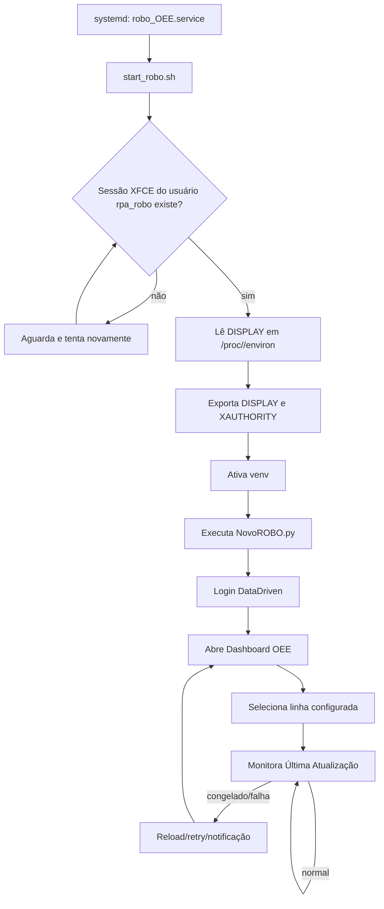

# Monitor OEE Dashboard — RPA de Exibição e Supervisão

Automação profissional para manter o **Dashboard OEE** da plataforma DataDriven aberto, atualizado e visível em tela cheia em uma estação/VM Linux com ambiente gráfico. O processo foi desenhado para operar de forma contínua, com recuperação automática em caso de travamento do dashboard, notificações por Telegram e painel auxiliar para acompanhamento dos recursos da máquina.

> **Ponto crítico da infraestrutura:** este robô depende de uma sessão gráfica real. Em uma VM compartilhada por vários usuários, o `DISPLAY` não pode ser fixo (`:0`, `:1`, etc.), porque ele pode variar conforme a sessão ativa. Por isso, o boot do robô localiza dinamicamente a sessão `xfce4` do usuário de operação e injeta o `DISPLAY` correto antes de iniciar o Playwright.

---

## Visão geral

O projeto é composto por dois processos principais:

| Processo | Arquivo | Objetivo |
| --- | --- | --- |
| Robô OEE | `NovoROBO.py` | Acessa a plataforma DataDriven, autentica, abre o Dashboard OEE, seleciona a linha configurada e mantém a tela ativa. |
| Monitor local | `Monitoramento.py` | Expõe um painel Flask para acompanhar CPU, RAM, disco, rede, histórico e picos de utilização da VM. |

Além disso, há uma camada de infraestrutura para inicialização automática:

| Arquivo | Função |
| --- | --- |
| `start_robo.sh` | Script de boot que detecta dinamicamente o `DISPLAY`, exporta `XAUTHORITY`, ativa o ambiente virtual e executa o robô. |
| `robo_OEE.service` | Unidade `systemd` que mantém o robô em execução e reinicia automaticamente em caso de falha. |

---

## Principais recursos

- Login automático na plataforma DataDriven usando variáveis do `.env`.
- Navegação automatizada até o menu **Dashboard > Manufatura > OEE-Online**.
- Interação com conteúdo dentro de `iframe` usando Playwright.
- Seleção automática da linha configurada em `Nome_linha`.
- Ajuste de visualização para modo tela cheia/kiosk com Playwright, `F11` e `xdotool`.
- Verificação contínua do indicador **Última Atualização** para detectar dashboard congelado.
- Reload periódico configurável por `F5` ou recarregamento da página.
- Recuperação automática com retry quando a abertura do dashboard falha.
- Notificações por Telegram em eventos importantes ou falhas.
- Serviço `systemd` com restart automático.
- Monitor Flask opcional para saúde da VM: CPU, RAM, disco, rede e picos.
- Suporte a acesso externo do monitor via ngrok, quando configurado.

---

## Arquitetura do processo



---

## Infraestrutura: captura dinâmica do DISPLAY

### Por que isso foi necessário?

O robô usa navegador Chromium em modo **não headless** (`headless=False`) e também ferramentas de interação com tela, como `xdotool`. Portanto, ele precisa estar conectado a uma sessão gráfica X11 válida.

Em uma VM com **múltiplos usuários** ou múltiplas sessões gráficas, o valor de `DISPLAY` pode mudar entre execuções. Fixar manualmente algo como `DISPLAY=:0` cria risco de o serviço iniciar no display errado, não encontrar a tela do usuário correto ou falhar ao abrir o navegador.

### Como foi resolvido?

O script `start_robo.sh` procura o processo `xfce4-session` do usuário operacional `rpa_robo`, lê as variáveis de ambiente reais desse processo em `/proc/<pid>/environ`, extrai o `DISPLAY` ativo e exporta esse valor para o processo do robô.

Fluxo implementado:

1. O serviço `systemd` inicia `start_robo.sh` como usuário `rpa_robo`.
2. O script aguarda até 30 tentativas, com intervalo de 10 segundos, pela sessão `xfce4-session`.
3. Ao encontrar a sessão, lê o `DISPLAY` diretamente do ambiente do processo XFCE.
4. Exporta `DISPLAY` e `XAUTHORITY=/home/rpa_robo/.Xauthority`.
5. Entra no diretório do projeto, ativa o `venv` e executa `NovoROBO.py`.
6. Caso nenhum display seja encontrado em até 5 minutos, aborta com erro para o `systemd` reiniciar conforme a política configurada.

Essa abordagem deixa o robô mais robusto para operação em VM compartilhada, pois ele sempre tenta acoplar o Chromium ao display gráfico realmente associado ao usuário de operação.

---

## Estrutura do repositório

```text
.
├── Monitoramento.py     # Painel Flask de monitoramento da VM
├── NovoROBO.py          # Automação principal do Dashboard OEE
├── README.md            # Documentação do projeto
├── robo_OEE.service     # Unidade systemd do robô
└── start_robo.sh        # Boot script com descoberta dinâmica de DISPLAY
```

---

## Pré-requisitos

### Sistema operacional

- Linux com ambiente gráfico X11.
- Sessão XFCE para o usuário operacional `rpa_robo`.
- Python 3.9 ou superior.
- `systemd` para execução como serviço.

### Pacotes do sistema

Instale os utilitários necessários para execução com navegador e controle de tela:

```bash
sudo apt update
sudo apt install -y python3 python3-venv python3-pip xdotool
```

> Dependendo da distribuição, o Playwright pode solicitar bibliotecas adicionais do Chromium. Nesse caso, execute `playwright install-deps` dentro do ambiente virtual.

### Dependências Python

O projeto utiliza, no mínimo:

- `playwright`
- `python-dotenv`
- `requests`
- `flask`
- `psutil`
- `pyngrok` (opcional, apenas para acesso externo ao monitor)

---

## Instalação

### 1. Clonar ou copiar o projeto

O serviço atual espera o projeto no diretório abaixo:

```bash
/home/rpa_robo/Robo_OEE
```

Exemplo:

```bash
sudo -u rpa_robo git clone <URL_DO_REPOSITORIO> /home/rpa_robo/Robo_OEE
cd /home/rpa_robo/Robo_OEE
```

### 2. Criar ambiente virtual

```bash
python3 -m venv venv
source venv/bin/activate
python -m pip install --upgrade pip
```

### 3. Instalar dependências

Se houver um `requirements.txt` no ambiente de implantação:

```bash
pip install -r requirements.txt
```

Ou instale manualmente as dependências mínimas:

```bash
pip install playwright python-dotenv requests flask psutil pyngrok
playwright install chromium
```

### 4. Configurar permissões do script de boot

```bash
chmod +x /home/rpa_robo/start_robo.sh
```

> Se o script ficar dentro do repositório, copie ou referencie corretamente em `/home/rpa_robo/start_robo.sh`, conforme configurado em `robo_OEE.service`.

---

## Configuração do `.env`

Crie um arquivo `.env` na raiz do projeto com as variáveis abaixo:

```env
# Credenciais DataDriven
Login=usuario@empresa.com
senha=sua_senha
Nome_linha=NOME_DA_LINHA

# Telegram
Telegram_Token=
Telegram_Chat_ID=

# Comportamento do robô
TEMPO_ATUALIZACAO_SEGUNDOS=3600
MODO_ATUALIZACAO=F5
ESPERA_CARREGAMENTO_LINHAS_SEGUNDOS=5
ESPERA_ENTRE_ACOES_IFRAME_SEGUNDOS=2

# Monitor local
MONITOR_PORTA=5001
MONITOR_INTERVALO=3
MONITOR_HISTORICO=120
LIMIAR_PICO_CPU=80
LIMIAR_PICO_RAM=85

# Opcional: acesso externo ao monitor
NGROK_TOKEN=
```

### Variáveis principais

| Variável | Descrição | Exemplo |
| --- | --- | --- |
| `Login` | Usuário de acesso à plataforma DataDriven. | `operacao@empresa.com` |
| `senha` | Senha de acesso à plataforma. | `********` |
| `Nome_linha` | Texto usado para identificar a linha na lista de detalhes. | `Linha 01` |
| `Telegram_Token` | Token do bot Telegram. | `123456:ABC...` |
| `Telegram_Chat_ID` | Chat ID para envio de alertas. | `-1001234567890` |
| `TEMPO_ATUALIZACAO_SEGUNDOS` | Intervalo para atualização periódica do dashboard. | `3600` |
| `MODO_ATUALIZACAO` | Modo de atualização: `F5` ou reload da página. | `F5` |
| `ESPERA_CARREGAMENTO_LINHAS_SEGUNDOS` | Tempo para aguardar a lista de linhas carregar. | `5` |
| `ESPERA_ENTRE_ACOES_IFRAME_SEGUNDOS` | Pausa entre ações no iframe. | `2` |

---

## Execução manual

Com uma sessão gráfica ativa para o usuário correto:

```bash
cd /home/rpa_robo/Robo_OEE
source venv/bin/activate
python NovoROBO.py
```

Para executar o monitor local:

```bash
cd /home/rpa_robo/Robo_OEE
source venv/bin/activate
python Monitoramento.py
```

Acesse:

- Local: `http://localhost:5001`
- Rede: `http://<IP_DA_VM>:5001`
- Externo: URL pública do ngrok, quando `NGROK_TOKEN` estiver configurado.

---

## Execução como serviço systemd

### 1. Instalar a unidade

```bash
sudo cp robo_OEE.service /etc/systemd/system/robo_OEE.service
sudo systemctl daemon-reload
```

### 2. Habilitar inicialização automática

```bash
sudo systemctl enable robo_OEE.service
```

### 3. Iniciar o serviço

```bash
sudo systemctl start robo_OEE.service
```

### 4. Verificar status e logs

```bash
sudo systemctl status robo_OEE.service
journalctl -u robo_OEE.service -f
```

O serviço está configurado para:

- rodar como usuário `rpa_robo`;
- iniciar após rede e ambiente gráfico;
- executar `/home/rpa_robo/start_robo.sh`;
- reiniciar automaticamente em caso de falha;
- aguardar 15 segundos entre reinícios.

---

## Comportamento operacional do robô

1. Inicia o Chromium em modo visível, maximizado, fullscreen/kiosk.
2. Abre a tela de login da plataforma DataDriven.
3. Preenche e envia as credenciais do `.env`.
4. Navega pelo menu até o Dashboard OEE.
5. Injeta a chamada `loadPageNew(...)` para carregar o dashboard desejado no `iframe`.
6. Aguarda a lista de linhas e clica no botão **Detalhes** da linha configurada.
7. Executa interações iniciais no iframe: refresh, modo tela cheia, fechamento de modal e F11.
8. Monitora o campo **Última Atualização** a cada 2 minutos.
9. Se o valor ficar igual por 5 ciclos, considera o dashboard congelado e executa recuperação.
10. Também realiza atualização periódica conforme `TEMPO_ATUALIZACAO_SEGUNDOS`.

---

## Monitoramento da VM

O arquivo `Monitoramento.py` sobe uma aplicação Flask com:

- endpoint `/api/stats` para métricas atuais e histórico;
- endpoint `/api/limpar_picos` para limpar picos registrados;
- dashboard web embutido em HTML/CSS/JavaScript;
- coleta periódica configurável por `MONITOR_INTERVALO`;
- histórico em memória limitado por `MONITOR_HISTORICO`;
- persistência dos últimos picos em `monitor_picos.json`;
- túnel ngrok opcional para acesso externo.

Esse monitor é útil para validar se a VM tem recursos suficientes para manter navegador, sessão gráfica e automação rodando continuamente.

---

## Troubleshooting

### O robô não abre o navegador

Verifique se existe sessão gráfica XFCE ativa para o usuário `rpa_robo`:

```bash
pgrep -u rpa_robo xfce4-session -a
```

Se não houver sessão, faça login gráfico com o usuário operacional ou reinicie o ambiente gráfico da VM.

### Erro relacionado a DISPLAY

Confirme se o script consegue detectar o `DISPLAY`:

```bash
bash /home/rpa_robo/start_robo.sh
```

Nos logs deve aparecer algo como:

```text
DISPLAY encontrado: :1
Iniciando robô com DISPLAY=:1
```

Se o valor não aparecer, a sessão XFCE ainda não está disponível ou pertence a outro usuário.

### Playwright não encontra navegador ou bibliotecas

Execute dentro do `venv`:

```bash
playwright install chromium
playwright install-deps
```

### Serviço reiniciando repetidamente

Acompanhe os logs:

```bash
journalctl -u robo_OEE.service -f
```

Valide especialmente:

- credenciais no `.env`;
- existência do diretório `/home/rpa_robo/Robo_OEE`;
- existência do `venv`;
- permissão de execução do `start_robo.sh`;
- sessão XFCE ativa;
- conectividade com a plataforma DataDriven.

---

## Boas práticas de operação

- Mantenha o `.env` fora do controle de versão.
- Use um usuário dedicado para o robô (`rpa_robo`).
- Evite fixar `DISPLAY` manualmente em VM compartilhada.
- Monitore os logs do `systemd` após reinícios da VM.
- Valide periodicamente o funcionamento das notificações Telegram.
- Use o monitor Flask para acompanhar consumo de CPU/RAM, principalmente quando houver múltiplos usuários na mesma VM.

---

## Segurança

- Não publique credenciais, tokens do Telegram ou URLs internas sensíveis.
- Restrinja o acesso de rede ao monitor Flask quando exposto fora da VM.
- Ao utilizar ngrok, trate a URL pública como sensível.
- Prefira permissões mínimas para o usuário operacional.

---

## Resumo executivo

Este projeto entrega uma solução de RPA para manter um Dashboard OEE em exibição contínua, com foco em estabilidade operacional. O diferencial da implantação está na camada de infraestrutura: em vez de depender de um display fixo, o boot identifica dinamicamente o `DISPLAY` real da sessão XFCE do usuário do robô, tornando a execução muito mais confiável em uma VM compartilhada por vários usuários.
